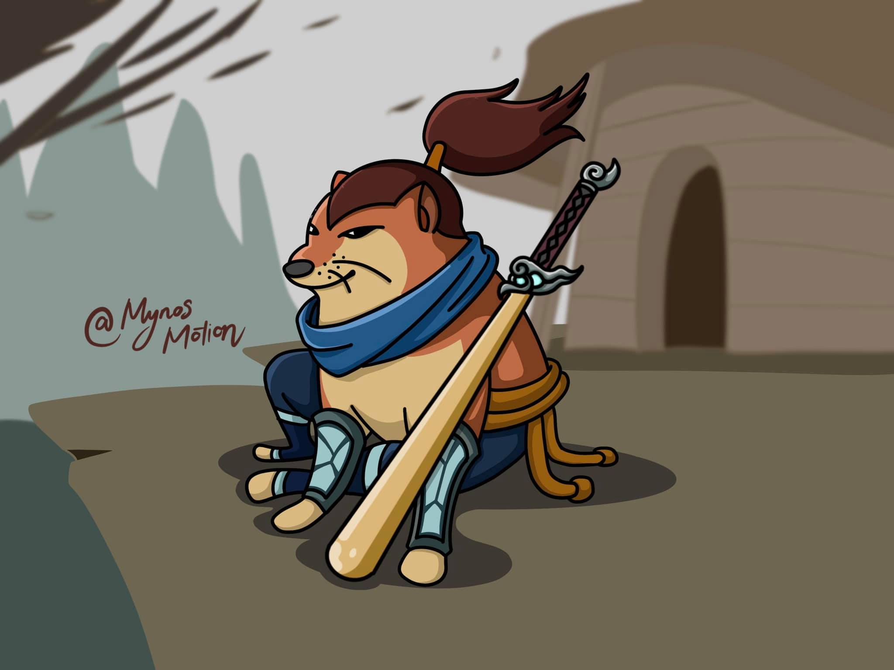

# Menu

### este es un indice basico para repositorio del *Python Study Group For Beginners*, utiliza Markdown sencillo:

## Retos de Sesion 01
1. [Ejercicio 1](https://github.com/amldimsed/psg-example/blob/main/retos_sesion_01/ejercicio_01.txt)
2. [Ejercicio 2](https://github.com/amldimsed/psg-example/blob/main/retos_sesion_01/ejercicio_02.txt)
## Retos de Sesion 02
1. [Ejercicio 1](https://github.com/amldimsed/psg-example/blob/main/retos_sesion_02/ejercicio_01.md)
2. [Ejercicio 2](https://github.com/amldimsed/psg-example/blob/main/retos_sesion_02/ejercicio_02.md)

## Retos de Sesion 03
1. [Ejercicio 1](https://github.com/amldimsed/psg-example/blob/main/retos_sesion_03/ejercicio_01.py)
2. [Ejercicio 2](https://github.com/amldimsed/psg-example/blob/main/retos_sesion_03/ejercicio_02.py)
3. [Ejercicio 3](https://github.com/amldimsed/psg-example/blob/main/retos_sesion_03/ejercicio_03.py)

## Retos de Sesion 04
1. [Ejercicio 1](https://github.com/amldimsed/psg-example/blob/main/retos_sesion_04/ejercicio_01.py)
2. [Ejercicio 2](https://github.com/amldimsed/psg-example/blob/main/retos_sesion_04/ejercicio_02.ipynb)
3. [Ejercicio 3](https://github.com/amldimsed/psg-example/blob/main/retos_sesion_04/ejercicio_03.py)
4. [Ejercicio 4](https://github.com/amldimsed/psg-example/blob/main/retos_sesion_04/ejercicio_04.ipynb)

## Retos de Sesion 05
1. [Ejercicio 1](https://github.com/amldimsed/psg-example/blob/main/retos_sesion_05/ejercicio_01.py)
2. [Ejercicio 2](https://github.com/amldimsed/psg-example/blob/main/retos_sesion_05/ejercicio_02.py)
3. [Ejercicio 3](https://github.com/amldimsed/psg-example/blob/main/retos_sesion_05/ejercicio_03.py)
4. [Ejercicio 4](https://github.com/amldimsed/psg-example/blob/main/retos_sesion_05/ejercicio_04.py)
5. [Ejercicio 5](https://github.com/amldimsed/psg-example/blob/main/retos_sesion_05/ejercicio_05.ipynb)

## Retos de Sesion 06
1. [Ejercicio 1](https://github.com/amldimsed/psg-example/blob/main/retos_sesion_06/ejercicio_01.py)
2. [Ejercicio 2](https://github.com/amldimsed/psg-example/blob/main/retos_sesion_06/ejercicio_02.py)
3. [Ejercicio 3](https://github.com/amldimsed/psg-example/blob/main/retos_sesion_06/ejercicio_03.py)
4. [Ejercicio 4](https://github.com/amldimsed/psg-example/blob/main/retos_sesion_06/ejercicio_04.py)
5. [Ejercicio 5](https://github.com/amldimsed/psg-example/blob/main/retos_sesion_06/ejercicio_05.py)
6. [Ejercicio 6](https://github.com/amldimsed/psg-example/blob/main/retos_sesion_06/ejercicio_06.py)
7. [Ejercicio 7](https://github.com/amldimsed/psg-example/blob/main/retos_sesion_06/ejercicio_07.py)
8. [Ejercicio 8](https://github.com/amldimsed/psg-example/blob/main/retos_sesion_06/sesion08.ipynb)

## Retos de Sesion 07
1. [Ejercicio 1](https://github.com/amldimsed/psg-example/blob/main/retos_sesion_07/ejercicio_01.py)
2. [Ejercicio 2](https://github.com/amldimsed/psg-example/blob/main/retos_sesion_07/ejercicio_02.py)
3. [Ejercicio 3](https://github.com/amldimsed/psg-example/blob/main/retos_sesion_07/ejercicio_03.py)
4. [Ejercicio 4](https://github.com/amldimsed/psg-example/blob/main/retos_sesion_07/ejercicio_04.py)
5. [Ejercicio 5](https://github.com/amldimsed/psg-example/blob/main/retos_sesion_07/ejercicio_05.py)
6. [Ejercicio 6](https://github.com/amldimsed/psg-example/blob/main/retos_sesion_07/ejercicio_06.py)
7. [Ejercicio 7](https://github.com/amldimsed/psg-example/blob/main/retos_sesion_07/ejercicio_07.ipynb)

## Retos de Sesion 08
1. [Ejercicio 1](https://github.com/amldimsed/psg-example/blob/main/retos_sesion_08/ejercicio_01.py)
2. [Ejercicio 2](https://github.com/amldimsed/psg-example/blob/main/retos_sesion_08/ejercicio_02.py)
3. [Ejercicio 3](https://github.com/amldimsed/psg-example/blob/main/retos_sesion_08/ejercicio_03.py)
4. [Ejercicio 4](https://github.com/amldimsed/psg-example/blob/main/retos_sesion_08/ejercicio_04.py)
5. [Ejercicio 5](https://github.com/amldimsed/psg-example/blob/main/retos_sesion_08/ejercicio_05.py)
6. [Ejercicio 6](https://github.com/amldimsed/psg-example/blob/main/retos_sesion_08/ejercicio_06.py)
7. [Ejercicio 7](https://github.com/amldimsed/psg-example/blob/main/retos_sesion_08/ejercicio_07.ipynb)

## Retos de Sesion 09
1. [Ejercicio 1](https://github.com/amldimsed/psg-example/blob/main/retos_sesion_09/ejercicio_01.py)
2. [Ejercicio 2](https://github.com/amldimsed/psg-example/blob/main/retos_sesion_09/ejercicio_02.py)
3. [Ejercicio 3](https://github.com/amldimsed/psg-example/blob/main/retos_sesion_09/ejercicio_03.py)
4. [Ejercicio 4](https://github.com/amldimsed/psg-example/blob/main/retos_sesion_09/ejercicio_04.py)
5. [Ejercicio 5](https://github.com/amldimsed/psg-example/blob/main/retos_sesion_09/sesion09.ipynb)

## Retos de Sesion 10
1. [Ejercicio 1]()
2. [Ejercicio 2]()
3. [Ejercicio 3]()
4. [Ejercicio 4]()
5. [Ejercicio 5]()

## Retos de Sesion 11
1. [Ejercicio 1](https://github.com/amldimsed/psg-example/blob/main/retos_sesion_11/ejercicio_01.py)
2. [Ejercicio 2](https://github.com/amldimsed/psg-example/blob/main/retos_sesion_11/ejercicio_02.py)
3. [Ejercicio 3](https://github.com/amldimsed/psg-example/blob/main/retos_sesion_11/ejercicio_03.py)
4. [Ejercicio 4](https://github.com/amldimsed/psg-example/blob/main/retos_sesion_11/ejercicio_04.py)
5. [Ejercicio 5](https://github.com/amldimsed/psg-example/blob/main/retos_sesion_11/ejercicio_05.py)
6. [Ejercicio 6](https://github.com/amldimsed/psg-example/blob/main/retos_sesion_11/sesion11.ipynb)

## Retos de Sesion 12
1. [Ejercicio 1](https://github.com/amldimsed/psg-example/blob/main/retos_sesion_12/ejercicio_01.py)
2. [Ejercicio 2](https://github.com/amldimsed/psg-example/blob/main/retos_sesion_12/ejercicio_02.py)
3. [Ejercicio 3](https://github.com/amldimsed/psg-example/blob/main/retos_sesion_12/ejercicio_03.py)
4. [Ejercicio 4](https://github.com/amldimsed/psg-example/blob/main/retos_sesion_12/ejercicio_04.py)
5. [Ejercicio 5](https://github.com/amldimsed/psg-example/blob/main/retos_sesion_12/ejercicio_05.py)
6. [Ejercicio 6](https://github.com/amldimsed/psg-example/blob/main/retos_sesion_12/ejercicio_06.py)
7. [Ejercicio 7](https://github.com/amldimsed/psg-example/blob/main/retos_sesion_12/sesion12.ipynb)

## Retos de Sesion 13
1. [Ejercicio 1](https://github.com/amldimsed/psg-example/blob/main/retos_sesion_13/ejercicio_01.py)
2. [Ejercicio 2](https://github.com/amldimsed/psg-example/blob/main/retos_sesion_13/ejercicio_02.py)
3. [Ejercicio 3](https://github.com/amldimsed/psg-example/blob/main/retos_sesion_13/ejercicio_03.py)
4. [Ejercicio 4](https://github.com/amldimsed/psg-example/blob/main/retos_sesion_13/ejercicio_04.py)
5. [Ejercicio 5](https://github.com/amldimsed/psg-example/blob/main/retos_sesion_13/ejercicio_05.py)
6. [Ejercicio 6](https://github.com/amldimsed/psg-example/blob/main/retos_sesion_13/ejercicio_06.py)
7. [Ejercicio 7](https://github.com/amldimsed/psg-example/blob/main/retos_sesion_13/ejercicio_07.py)
8. [Ejercicio 8](https://github.com/amldimsed/psg-example/blob/main/retos_sesion_13/sesion13.ipynb)

## Retos de Sesion 14
1. [Ejercicio 1](https://github.com/amldimsed/psg-example/blob/main/retos_sesion_14/ejercicio_01.py)
2. [Ejercicio 2](https://github.com/amldimsed/psg-example/blob/main/retos_sesion_14/ejercicio_02.py)
3. [Ejercicio 3](https://github.com/amldimsed/psg-example/blob/main/retos_sesion_14/ejercicio_03.py)
4. [Ejercicio 4](https://github.com/amldimsed/psg-example/blob/main/retos_sesion_14/ejercicio_04.py)
5. [Ejercicio 5](https://github.com/amldimsed/psg-example/blob/main/retos_sesion_14/ejercicio_05.py)
6. [Ejercicio 6](https://github.com/amldimsed/psg-example/blob/main/retos_sesion_14/ejercicio_06.py)
7. [Ejercicio 7](https://github.com/amldimsed/psg-example/blob/main/retos_sesion_14/ejercicio_07.py)
8. [Ejercicio 8](https://github.com/amldimsed/psg-example/blob/main/retos_sesion_14/sesion14.ipynb)

## Retos de Sesion 15
1. [Ejercicio 1](https://github.com/amldimsed/psg-example/blob/main/retos_sesion_15/ejercicio_01.py)
2. [Ejercicio 2](https://github.com/amldimsed/psg-example/blob/main/retos_sesion_15/ejercicio_02.py)
3. [Ejercicio 3](https://github.com/amldimsed/psg-example/blob/main/retos_sesion_15/ejercicio_03.py)
4. [Ejercicio 4](https://github.com/amldimsed/psg-example/blob/main/retos_sesion_15/sesion15.ipynb)

## Retos de Sesion - Bonus
1. [Ejercicio 1](https://github.com/amldimsed/psg-example/blob/main/retos_sesion_bonus/ejercicio_01.py)
2. [Ejercicio 2](https://github.com/amldimsed/psg-example/blob/main/retos_sesion_bonus/ejercicio_02.py)

## Reto Semanal
1. [Reto 01](https://github.com/amldimsed/psg-example/blob/main/retos/reto_01.ipynb)
2. [Reto 02](https://github.com/amldimsed/psg-example/blob/main/retos/reto_02.ipynb)

## Mini Extra Retos
1. [Busca Minas](https://github.com/amldimsed/psg-example/blob/main/extras_retos/buscaminas.ipynb)
2. [Tetriz-mini](https://github.com/amldimsed/psg-example/blob/main/extras_retos/tetriz_logica.ipynb)

# **Cheems Chen**

# **Cheemsmaster Brewmaster**

# **Techeems Techies**

# **Cheemsou Yasou**

# **Cheemko Neeko**

# **Cheems Samurai**
